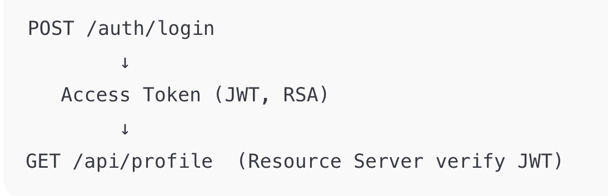

# 1. JWT & Liên quan
## 1.1 JWT là gì?
JWT (JSON Web Token) là 1 chuỗi token dùng để xác thực và phân quyền.

```
header.payload.signature
```

Ví dụ:
```
eyJhbGciOiJSUzI1NiIsInR5cCI6IkpXVCJ9.eyJzdWIiOiJ1MDEiLCJyb2xlIjoiVVNFUiJ9.xxx
```

## 1.2 JWT dùng để làm gì?
- Thay thế session
- Xác thực user stateless
- Phù hợp microservice

## 1.3 RSA dùng để làm g?
- RSA là thuật toán bất đối xứng, private key ký token, public key verify token.

## 1.4 OAuth2 Resource Server là gì?
- Là server chỉ chịu trách nhiệm kiểm tra và xác thực token.

# 2. Access Token & Refresh Token
## 2.1 Access Token
- Thời gian sống ngắn (5–15 phút)
- Gửi kèm mỗi request:
```
Authorization: Bearer <access_token>
```
- Dùng để truy cập API


## 2.2 Refresh Token
- Thời gian sống dài
- Dùng để xin access token mới
- Không gửi trong mọi request

```quote
“Refresh token giúp tăng bảo mật và trải nghiệm người dùng.”
```

# 3. Các bước thực hiện


## 3.1 Tạo Spring Boot Resource Server (RSA)
### 3.1.1 Tạo project Spring Boot
Chọn dependencies:
- Spring Web
- Spring Security
- OAuth2 Resource Server


```cmd
cd jwt-oauth2/jwt-resource-server
./mvnw spring-boot:run
```

### 3.1.2 Tạo RSA key (bắt buộc)
```cmd
cd jwt-oauth2
openssl genrsa -out private.pem 2048
openssl rsa -in private.pem -pubout -out public.pem
```

👉 Bạn sẽ có:
- `private.pem` → ký token
- `public.pem` → verify token

📁 Đặt public.pem vào:

```bash
mv public.pem jwt-resource-server/src/main/resources/
```

## 3.2 Cấu hình Resource Server (QUAN TRỌNG)
`jwt-resource-server/src/main/resources/application.yml`
```code
spring:
  security:
    oauth2:
      resourceserver:
        jwt:
          public-key-location: classpath:public.pem
```

💡 Ý nghĩa:
- Resource Server dùng RSA public key
- Verify JWT ký bằng private key

## 3.3 CẤU HÌNH SPRING SECURITY
`jwt-resource-server/src/main/java/com/lab/config/SecurityConfig.java`

## 3.4 Chạy lại project
```cmd
./mvnw spring-boot:run
```

## 3.5 Test nhanh (chưa cần token)
```
http://localhost:8080/api/test
```
👉 401 Unauthorized → ĐÚNG

## 3.6 Tạo JWT (Access Token) bằng RSA
MỤC TIÊU
- Có API /auth/login
- Trả về JWT (access token) ký bằng RSA private key
- Token dùng được cho Resource Server

Thêm thư viện JWT vào pom.xml
```
<!-- JWT -->
<dependency>
    <groupId>io.jsonwebtoken</groupId>
    <artifactId>jjwt-api</artifactId>
    <version>0.11.5</version>
</dependency>
<dependency>
    <groupId>io.jsonwebtoken</groupId>
    <artifactId>jjwt-impl</artifactId>
    <version>0.11.5</version>
    <scope>runtime</scope>
</dependency>
<dependency>
    <groupId>io.jsonwebtoken</groupId>
    <artifactId>jjwt-jackson</artifactId>
    <version>0.11.5</version>
    <scope>runtime</scope>
</dependency>
```

reload maven
```cmd 
cd jwt-oauth2/jwt-resource-server
./mvnw clean install
```

Tạo file `jwt-oauth2/jwt-resource-server/src/main/java/com/lab/controller/AuthController.java`

## 3.5 API login tạo token

## 3.6 API được bảo vệ (Resource)

## 3.7 Test
## 3.7.1 Login lấy token
```cmd
curl -X POST http://localhost:8080/auth/login \
-H "Content-Type: application/json" \
-d '{"username":"u01","password":"123"}'
```

## 3.7.2 Gọi API với token
```cmd
curl http://localhost:8080/api/profile \
-H "Authorization: Bearer <ACCESS_TOKEN>"
```