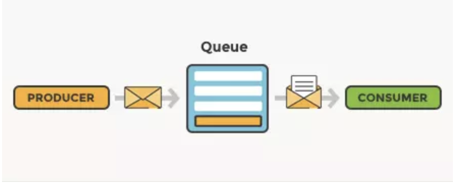

rabbitmq = Message Broker
producer = Gui message
consumer = Xu ly message

Các service giao tiếp qua network Docker


+----------+        +------------+        +-----------+
| Producer | -----> | RabbitMQ   | -----> | Consumer  |
+----------+        +------------+        +-----------+
                         Queue

curl -X POST http://localhost:3000/send \
  -H "Content-Type: application/json" \
  -d '{"message":"Order #1000 send"}'

curl -X POST http://localhost:3000/send \
-H "Content-Type: application/json" \
-d '{"orderId":"Order #1000 send", "message":"Test"}'



### 1. Tạo file docker-compose.yml
rabbitmq:4.2.2-management-alpine -> management-alpine là phiên bản nhẹ

### 2. Tạo file Dockerfile trong từng folder service

### 3. Tạo file xử lý cho từng service producer - consumer (producer.js - consumer.js)

### 4. Tạo file package.json trong từng folder service

### 5.
```cmd
docker compose build
docker compose up
```

### 6. Mở trang web quản trị RabbitMQ
`localhost:15672`

### 7. Test API
```cmd
curl -X POST http://localhost:3000/send \
  -H "Content-Type: application/json" \
  -d '{"message":"Order #1000 created"}'
```

```cmd
curl -X POST http://localhost:3000/send \
-H "Content-Type: application/json" \
-d '{"orderId":"Order #1000 send", "message":"Test"}'
```

Nếu thiếu message → 400
```cmd 
curl -X POST http://localhost:3000/send \
-H "Content-Type: application/json" \
-d '{"orderId":"Order #1000 send"}'
```

### 8. Xem log producer / consumer
```cmd
docker compose logs producer
```

```cmd
docker compose logs consumer
```

### 9. Chạy test register
```cmd
curl -X POST http://localhost:3000/register \
-H "Content-Type: application/json" \
-d '{"userId":"u01","email":"u01@gmail.com"}'
```

